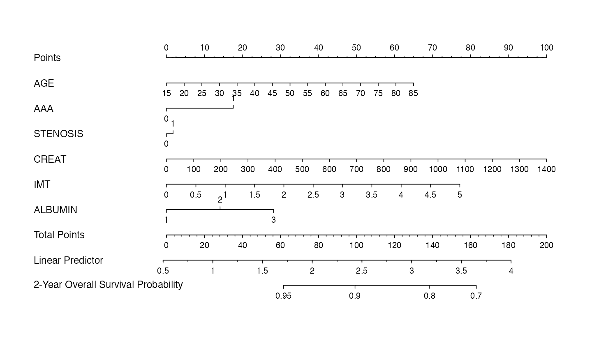
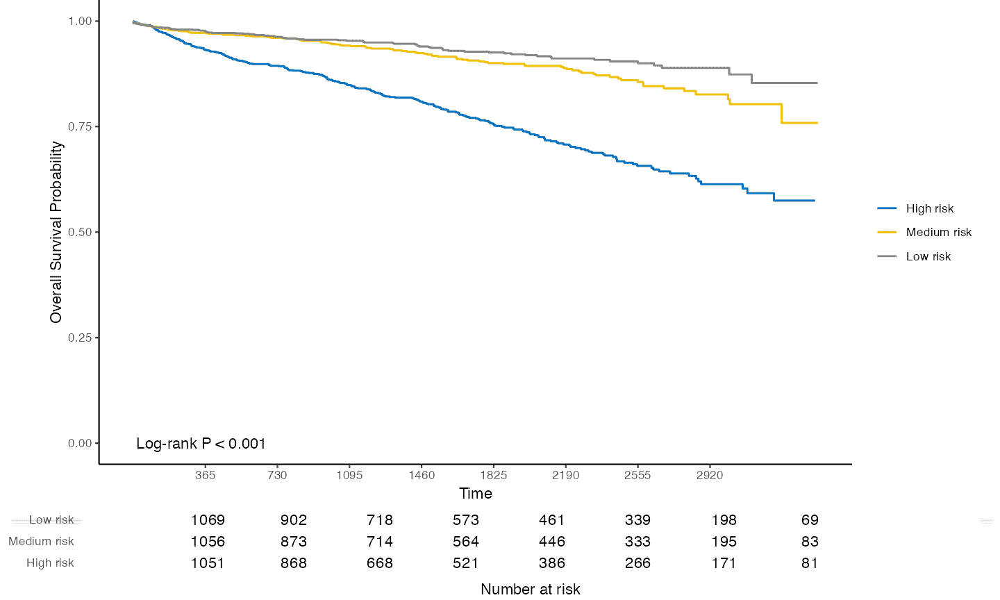
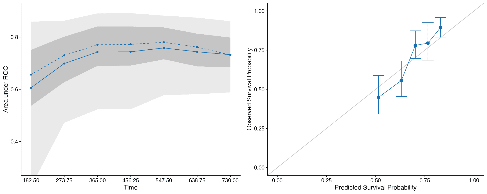

<!-- README.md is generated from README.Rmd. Please edit that file -->

# hdnom 

<!-- badges: start -->

[](https://github.com/nanxstats/hdnom/actions)
[](https://cran.r-project.org/package=hdnom)
[](https://cranlogs.r-pkg.org/badges/hdnom)
<!-- badges: end -->

`hdnom` creates nomogram visualizations for penalized Cox regression
models, with the support of reproducible survival model building,
validation, calibration, and comparison for high-dimensional data.

## Installation

You can install `hdnom` from CRAN:

``` r
install.packages("hdnom")
```

Or try the development version on GitHub:

``` r
remotes::install_github("nanxstats/hdnom")
```

Browse [the vignettes](https://nanx.me/hdnom/articles/) to get started.

## Gallery

### Nomogram



### Kaplan-Meier plot with number at risk table



### Model validation and calibration



### Model comparison by validation or calibration


## Links

-   Documentation: <https://nanx.me/hdnom/>
-   Shiny app: <http://hdnom.io>
-   App maker: <https://github.com/nanxstats/hdnom-appmaker>

## Contribute

To contribute to this project, please take a look at the [Contributing
Guidelines](https://github.com/nanxstats/hdnom/blob/master/CONTRIBUTING.md)
first. Please note that this project is released with a [Contributor
Code of
Conduct](https://github.com/nanxstats/hdnom/blob/master/CONDUCT.md). By
participating in this project you agree to abide by its terms.
