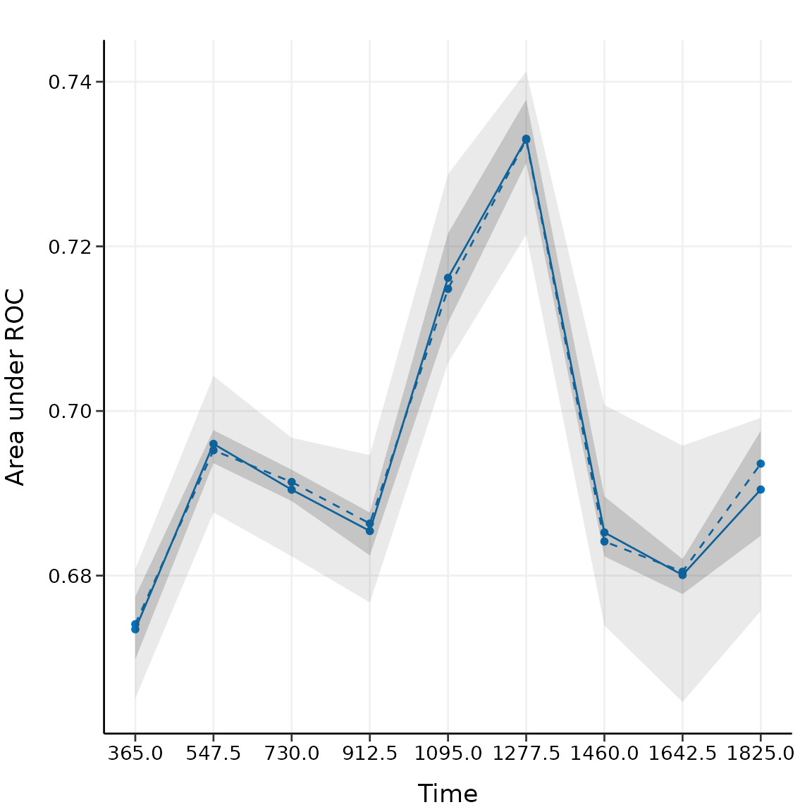
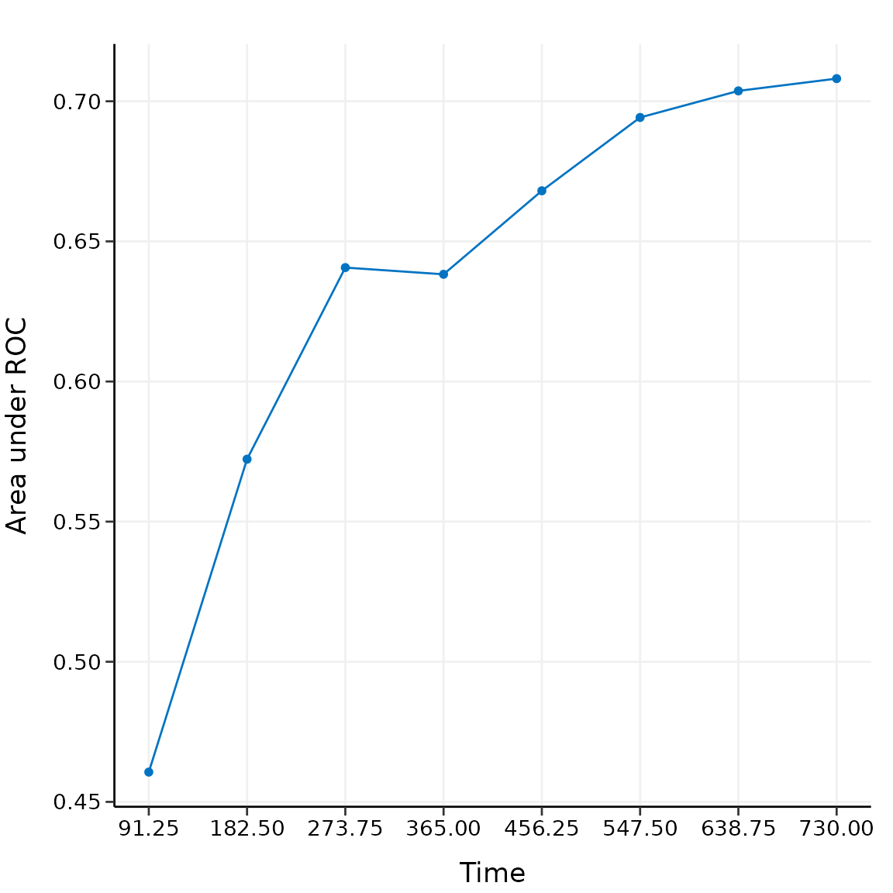
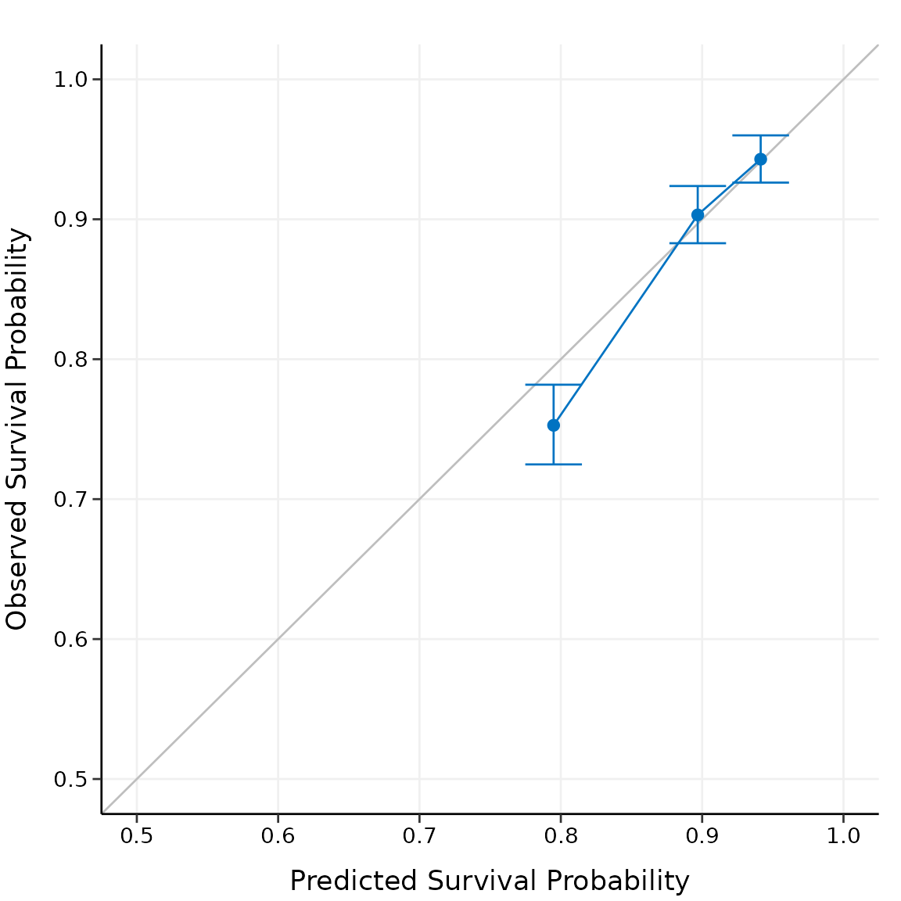
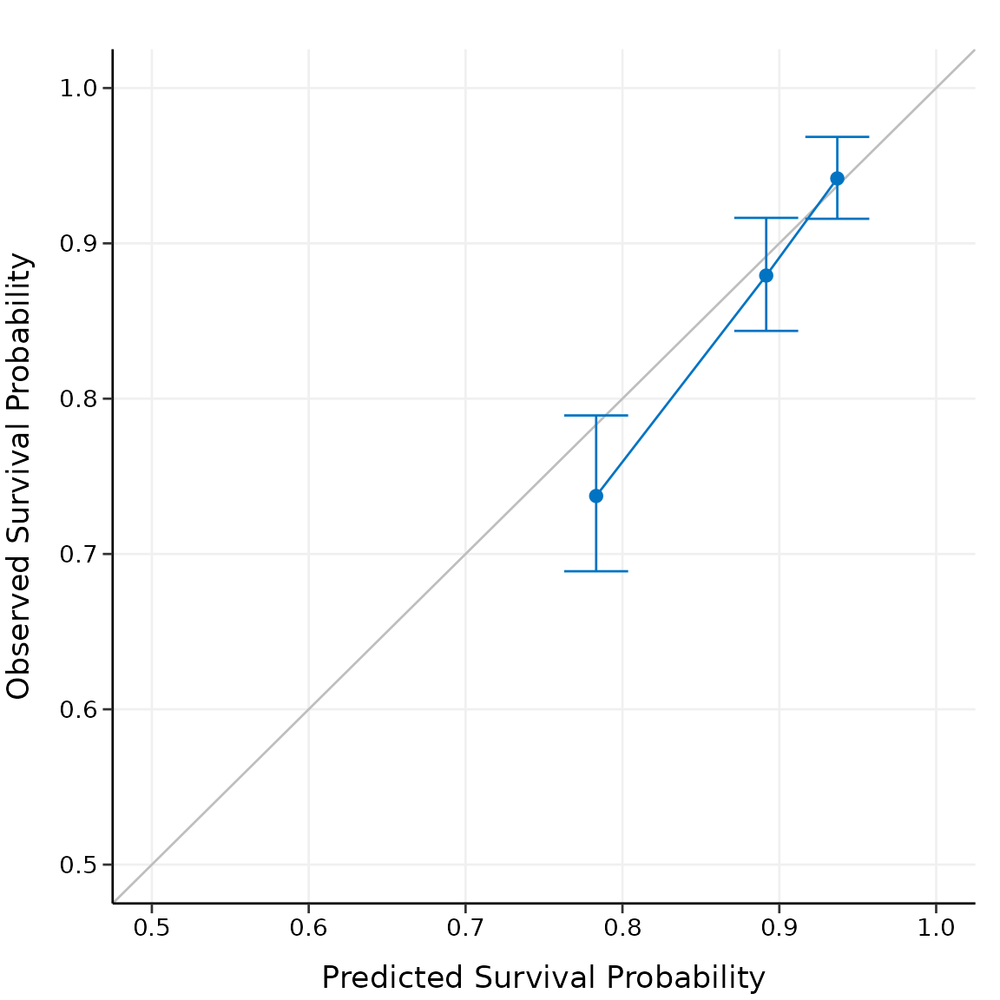
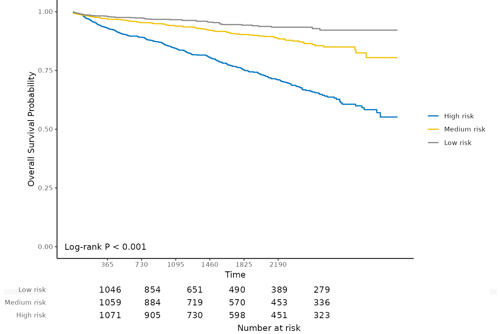
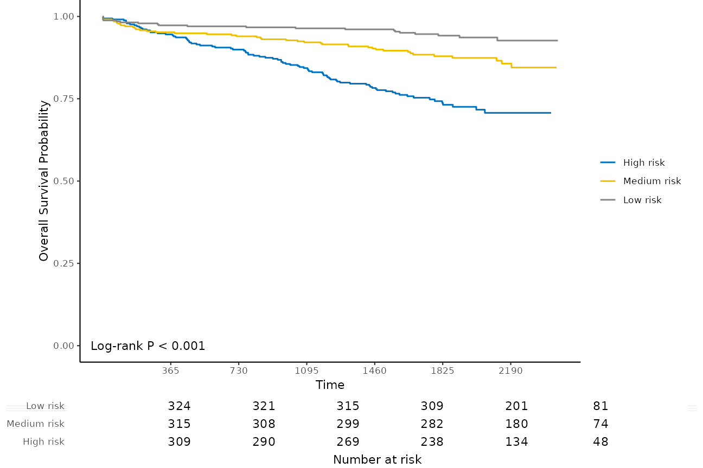
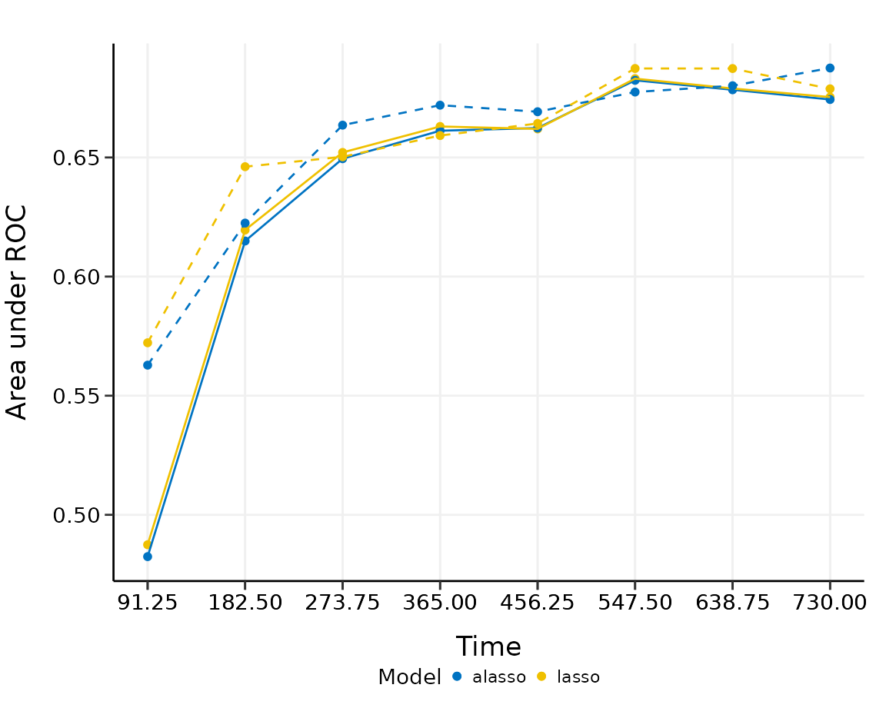
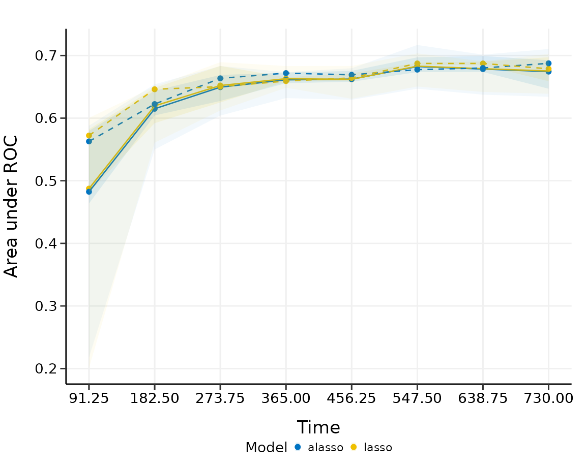
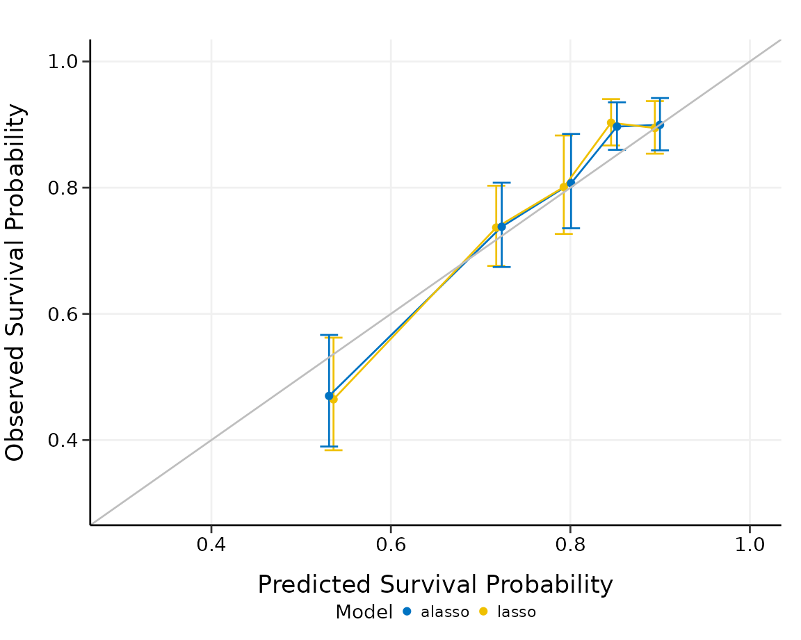

# An Introduction to hdnom

## Introduction

It is a challenging task to model the emerging high-dimensional clinical
data with survival outcomes. For its simplicity and efficiency,
penalized Cox models are significantly useful for accomplishing such
tasks.

`hdnom` streamlines the workflow of high-dimensional Cox model building,
nomogram plotting, model validation, calibration, and comparison.

## Build survival models

To build a penalized Cox model with good predictive performance, some
parameter tuning is usually needed. For example, the elastic-net model
requires to tune the $`\ell_1`$-$`\ell_2`$ penalty trade-off parameter
$`\alpha`$, and the regularization parameter $`\lambda`$.

To free the users from the tedious and error-prone parameter tuning
process, `hdnom` provides several functions for automatic parameter
tuning and model selection, including the following model types:

| Function name | Model type | Auto-tuned hyperparameters |
|----|----|----|
| [`fit_lasso()`](https://nanx.me/hdnom/reference/fit_lasso.md) | Lasso | $`\lambda`$ |
| [`fit_alasso()`](https://nanx.me/hdnom/reference/fit_alasso.md) | Adaptive lasso | $`\lambda`$ |
| [`fit_enet()`](https://nanx.me/hdnom/reference/fit_enet.md) | Elastic-net | $`\lambda`$, $`\alpha`$ |
| [`fit_aenet()`](https://nanx.me/hdnom/reference/fit_aenet.md) | Adaptive elastic-net | $`\lambda`$, $`\alpha`$ |
| [`fit_mcp()`](https://nanx.me/hdnom/reference/fit_mcp.md) | MCP | $`\gamma`$, $`\lambda`$ |
| [`fit_mnet()`](https://nanx.me/hdnom/reference/fit_mnet.md) | Mnet (MCP + $`\ell_2`$) | $`\gamma`$, $`\lambda`$, $`\alpha`$ |
| [`fit_scad()`](https://nanx.me/hdnom/reference/fit_scad.md) | SCAD | $`\gamma`$, $`\lambda`$ |
| [`fit_snet()`](https://nanx.me/hdnom/reference/fit_snet.md) | Snet (SCAD + $`\ell_2`$) | $`\gamma`$, $`\lambda`$, $`\alpha`$ |
| [`fit_flasso()`](https://nanx.me/hdnom/reference/fit_flasso.md) | Fused lasso | $`\lambda_1`$, $`\lambda_2`$ |

In the next, we will use the imputed SMART study data to demonstrate a
complete process of model building, nomogram plotting, model validation,
calibration, and comparison with `hdnom`.

Load the packages and the `smart` dataset:

``` r

library("hdnom")
```

``` r

data("smart")
x <- as.matrix(smart[, -c(1, 2)])
time <- smart$TEVENT
event <- smart$EVENT
y <- survival::Surv(time, event)
```

The dataset contains 3873 observations with corresponding survival
outcome (`time`, `event`). 27 clinical variables (`x`) are available as
the predictors. See [`?smart`](https://nanx.me/hdnom/reference/smart.md)
for a detailed explanation of the variables.

Fit a penalized Cox model by adaptive elastic-net regularization with
[`fit_aenet()`](https://nanx.me/hdnom/reference/fit_aenet.md) and enable
the parallel parameter tuning:

``` r

suppressMessages(library("doParallel"))
registerDoParallel(detectCores())

fit <- fit_aenet(x, y, nfolds = 10, rule = "lambda.min", seed = c(5, 7), parallel = TRUE)
names(fit)
```

    ## [1] "model"       "alpha"       "lambda"      "model_init"  "alpha_init" 
    ## [6] "lambda_init" "pen_factor"  "type"        "seed"        "call"  

Adaptive elastic-net includes two estimation steps. The random seed used
for parameter tuning, the selected best $`\alpha`$, the selected best
$`\lambda`$, the model fitted for each estimation step, and the penalty
factor for the model coefficients in the second estimation step are all
stored in the model object `fit`.

## Nomogram visualization

Before plotting the nomogram, we need to extract some necessary
information about the model: the model object and the selected
hyperparameters:

``` r

model <- fit$model
alpha <- fit$alpha
lambda <- fit$lambda
adapen <- fit$pen_factor
```

Let’s generate a nomogram object with
[`as_nomogram()`](https://nanx.me/hdnom/reference/as_nomogram.md) and
plot it:

``` r

nom <- as_nomogram(
  fit, x, time, event,
  pred.at = 365 * 2,
  funlabel = "2-Year Overall Survival Probability"
)

plot(nom)
```


According to the nomogram, the adaptive elastic-net model selected 18
variables from the original set of 27 variables and reduced the model
complexity.

Information about the nomogram itself, such as the point-linear
predictor unit mapping and total points-survival probability mapping,
can be viewed by printing the `nom` object directly.

## Model validation

It is a common practice to utilize resampling-based methods to validate
the predictive performance of a penalized Cox model. Bootstrap,
$`k`$-fold cross-validation, and repeated $`k`$-fold cross-validation
are the most employed methods for such purpose.

`hdnom` supports both internal model validation and external model
validation. Internal validation takes the dataset used to build the
model and evaluates the predictive performance on the data internally
with the above resampling-based methods, while external validation
evaluates the model’s predictive performance on a dataset which is
independent to the dataset used in model building.

### Internal validation

[`validate()`](https://nanx.me/hdnom/reference/validate.md) allows us to
assess the model performance internally by time-dependent AUC (Area
Under the ROC Curve) with the above three resampling methods.

Here, we validate the performance of the adaptive elastic-net model with
bootstrap resampling, at every half year from the first year to the
fifth year:

``` r

val_int <- validate(
  x, time, event,
  model.type = "aenet",
  alpha = alpha, lambda = lambda, pen.factor = adapen,
  method = "bootstrap", boot.times = 10,
  tauc.type = "UNO", tauc.time = seq(1, 5, 0.5) * 365,
  seed = 42, trace = FALSE
)

print(val_int)
#> High-Dimensional Cox Model Validation Object
#> Random seed: 42 
#> Validation method: bootstrap
#> Bootstrap samples: 10 
#> Model type: aenet 
#> glmnet model alpha: 0.05 
#> glmnet model lambda: 0.01326322 
#> glmnet model penalty factor: specified
#> Time-dependent AUC type: UNO 
#> Evaluation time points for tAUC: 365 547.5 730 912.5 1095 1277.5 1460 1642.5 1825
summary(val_int)
#> Time-Dependent AUC Summary at Evaluation Time Points
#>                365     547.5       730     912.5      1095    1277.5      1460
#> Mean     0.6734807 0.6960049 0.6904395 0.6854196 0.7161806 0.7330752 0.6852454
#> Min      0.6650818 0.6876721 0.6823491 0.6767386 0.7058442 0.7214400 0.6739606
#> 0.25 Qt. 0.6698185 0.6936594 0.6890617 0.6824515 0.7107146 0.7301220 0.6823311
#> Median   0.6741002 0.6952286 0.6913730 0.6863290 0.7148338 0.7329520 0.6841489
#> 0.75 Qt. 0.6774653 0.6976721 0.6928694 0.6876670 0.7215741 0.7378335 0.6896190
#> Max      0.6808046 0.7042611 0.6967414 0.6946401 0.7287474 0.7412459 0.7007416
#>             1642.5      1825
#> Mean     0.6800715 0.6904592
#> Min      0.6646386 0.6757193
#> 0.25 Qt. 0.6777540 0.6848380
#> Median   0.6804777 0.6936039
#> 0.75 Qt. 0.6820086 0.6976002
#> Max      0.6957852 0.6991609
```

The mean, median, 25%, and 75% quantiles of time-dependent AUC at each
time point across all bootstrap predictions are listed above. The median
and the mean can be considered as the bias-corrected estimation of the
model performance.

It is also possible to plot the model validation result:

``` r

plot(val_int)
#>                365     547.5       730     912.5      1095    1277.5      1460
#> Mean     0.6734807 0.6960049 0.6904395 0.6854196 0.7161806 0.7330752 0.6852454
#> Min      0.6650818 0.6876721 0.6823491 0.6767386 0.7058442 0.7214400 0.6739606
#> 0.25 Qt. 0.6698185 0.6936594 0.6890617 0.6824515 0.7107146 0.7301220 0.6823311
#> Median   0.6741002 0.6952286 0.6913730 0.6863290 0.7148338 0.7329520 0.6841489
#> 0.75 Qt. 0.6774653 0.6976721 0.6928694 0.6876670 0.7215741 0.7378335 0.6896190
#> Max      0.6808046 0.7042611 0.6967414 0.6946401 0.7287474 0.7412459 0.7007416
#>             1642.5      1825
#> Mean     0.6800715 0.6904592
#> Min      0.6646386 0.6757193
#> 0.25 Qt. 0.6777540 0.6848380
#> Median   0.6804777 0.6936039
#> 0.75 Qt. 0.6820086 0.6976002
#> Max      0.6957852 0.6991609
#> Warning: `aes_string()` was deprecated in ggplot2 3.0.0.
#> ℹ Please use tidy evaluation idioms with `aes()`.
#> ℹ See also `vignette("ggplot2-in-packages")` for more information.
#> ℹ The deprecated feature was likely used in the hdnom package.
#>   Please report the issue at <https://github.com/nanxstats/hdnom/issues>.
#> This warning is displayed once per session.
#> Call `lifecycle::last_lifecycle_warnings()` to see where this warning was
#> generated.
```



The solid line represents the mean of the AUC, the dashed line
represents the median of the AUC. The darker interval in the plot shows
the 25% and 75% quantiles of AUC, the lighter interval shows the minimum
and maximum of AUC.

It seems that the bootstrap-based validation result is stable: the
median and the mean value at each evaluation time point are close; the
25% and 75% quantiles are also close to the median at each time point.

Bootstrap-based validation often gives relatively stable results. Many
of the established nomograms in clinical oncology research are validated
by bootstrap methods. $`K`$-fold cross-validation provides a more strict
evaluation scheme than bootstrap. Repeated cross-validation gives
similar results as $`k`$-fold cross-validation, and usually more robust.
These two methods are more applied by the machine learning community.
Check [`?hdnom::validate`](https://nanx.me/hdnom/reference/validate.md)
for more examples about internal model validation.

### External validation

Now we have the internally validated model. To perform external
validation, we usually need an independent dataset (preferably,
collected in other studies), which has the same variables as the dataset
used to build the model. For penalized Cox models, the external dataset
should have at least the same variables that have been selected in the
model.

For demonstration purposes, here we draw 1000 samples from the `smart`
data and *assume* that they form an external validation dataset, then
use
[`validate_external()`](https://nanx.me/hdnom/reference/validate_external.md)
to perform external validation:

``` r

x_new <- as.matrix(smart[, -c(1, 2)])[1001:2000, ]
time_new <- smart$TEVENT[1001:2000]
event_new <- smart$EVENT[1001:2000]

val_ext <- validate_external(
  fit, x, time, event,
  x_new, time_new, event_new,
  tauc.type = "UNO",
  tauc.time = seq(0.25, 2, 0.25) * 365
)

print(val_ext)
#> High-Dimensional Cox Model External Validation Object
#> Model type: aenet 
#> Time-dependent AUC type: UNO 
#> Evaluation time points for tAUC: 91.25 182.5 273.75 365 456.25 547.5 638.75 730
summary(val_ext)
#> Time-Dependent AUC Summary at Evaluation Time Points
#>         91.25     182.5    273.75       365    456.25     547.5 638.75
#> AUC 0.4606283 0.5722837 0.6406513 0.6382541 0.6680544 0.6942158 0.7037
#>           730
#> AUC 0.7080763
plot(val_ext)
#>         91.25     182.5    273.75       365    456.25     547.5 638.75
#> AUC 0.4606283 0.5722837 0.6406513 0.6382541 0.6680544 0.6942158 0.7037
#>           730
#> AUC 0.7080763
```



The time-dependent AUC on the external dataset is shown above.

## Model calibration

Measuring how far the model predictions are from actual survival
outcomes is known as *calibration*. Calibration can be assessed by
plotting the predicted probabilities from the model versus actual
survival probabilities. Similar to model validation, both internal model
calibration and external model calibration are supported in `hdnom`.

### Internal calibration

[`calibrate()`](https://nanx.me/hdnom/reference/calibrate.md) provides
non-resampling and resampling methods for internal model calibration,
including direct fitting, bootstrap resampling, $`k`$-fold
cross-validation, and repeated cross-validation.

For example, to calibrate the model internally with the bootstrap
method:

``` r

cal_int <- calibrate(
  x, time, event,
  model.type = "aenet",
  alpha = alpha, lambda = lambda, pen.factor = adapen,
  method = "bootstrap", boot.times = 10,
  pred.at = 365 * 5, ngroup = 3,
  seed = 42, trace = FALSE
)

print(cal_int)
#> High-Dimensional Cox Model Calibration Object
#> Random seed: 42 
#> Calibration method: bootstrap
#> Bootstrap samples: 10 
#> Model type: aenet 
#> glmnet model alpha: 0.05 
#> glmnet model lambda: 0.01326322 
#> glmnet model penalty factor: specified
#> Calibration time point: 1825 
#> Number of groups formed for calibration: 3
summary(cal_int)
#>   Calibration Summary Table
#>   Predicted  Observed Lower 95% Upper 95%
#> 1 0.7945997 0.7517955 0.7238282 0.7808434
#> 2 0.8969428 0.9054051 0.8855463 0.9257094
#> 3 0.9411592 0.9416584 0.9245449 0.9590886
#> attr(,"cox.ties")
#> [1] "breslow"
```

We split the samples into three risk groups. In practice, the number of
risk groups is decided by the users according to their needs.

The model calibration results (the median of the predicted survival
probability; the median of the observed survival probability estimated
by Kaplan-Meier method with 95% CI) are summarized as above.

Plot the calibration result:

``` r

plot(cal_int, xlim = c(0.5, 1), ylim = c(0.5, 1))
```



In practice, you may want to perform calibration for multiple time
points separately, and put the plots together in one figure. See
[`?hdnom::calibrate`](https://nanx.me/hdnom/reference/calibrate.md) for
more examples about internal model calibration.

### External calibration

To perform external calibration with an external dataset, use
[`calibrate_external()`](https://nanx.me/hdnom/reference/calibrate_external.md):

``` r

cal_ext <- calibrate_external(
  fit, x, time, event,
  x_new, time_new, event_new,
  pred.at = 365 * 5, ngroup = 3
)

print(cal_ext)
#> High-Dimensional Cox Model External Calibration Object
#> Model type: aenet 
#> Calibration time point: 1825 
#> Number of groups formed for calibration: 3
summary(cal_ext)
#>   External Calibration Summary Table
#>   Predicted  Observed Lower 95% Upper 95%
#> 1 0.7832423 0.7373326 0.6888701 0.7892045
#> 2 0.8916501 0.8792732 0.8436384 0.9164132
#> 3 0.9369653 0.9418175 0.9158249 0.9685479
plot(cal_ext, xlim = c(0.5, 1), ylim = c(0.5, 1))
```



The external calibration results have the similar interpretations as the
internal calibration results, except the fact that external calibration
is performed on the external dataset.

### Kaplan-Meier analysis for risk groups

Internal calibration and external calibration both classify the testing
set into different risk groups. For internal calibration, the testing
set means all the samples in the dataset that was used to build the
model, for external calibration, the testing set means the samples from
the external dataset.

We can further analyze the differences in survival time for different
risk groups with Kaplan-Meier survival curves and a number at risk
table. For example, here we plot the Kaplan-Meier survival curves and
evaluate the number at risk from one year to six years for the three
risk groups, with the function
[`kmplot()`](https://nanx.me/hdnom/reference/kmplot.md):

``` r

kmplot(
  cal_int,
  group.name = c("High risk", "Medium risk", "Low risk"),
  time.at = 1:6 * 365
)
#> Warning: Using `size` aesthetic for lines was deprecated in ggplot2 3.4.0.
#> ℹ Please use `linewidth` instead.
#> ℹ The deprecated feature was likely used in the hdnom package.
#>   Please report the issue at <https://github.com/nanxstats/hdnom/issues>.
#> This warning is displayed once per session.
#> Call `lifecycle::last_lifecycle_warnings()` to see where this warning was
#> generated.
```



``` r


kmplot(
  cal_ext,
  group.name = c("High risk", "Medium risk", "Low risk"),
  time.at = 1:6 * 365
)
```



The $`p`$-value of the log-rank test is also shown in the plot.

### Log-rank test for risk groups

To compare the differences between the survival curves, log-rank test is
often applied.
[`logrank_test()`](https://nanx.me/hdnom/reference/logrank_test.md)
performs such tests on the internal calibration and external calibration
results:

``` r

cal_int_logrank <- logrank_test(cal_int)
cal_int_logrank
#> Call:
#> survdiff(formula = formula("Surv(time, event) ~ grp"))
#> 
#> n=3872, 1 observation deleted due to missingness.
#> 
#>          N Observed Expected (O-E)^2/E (O-E)^2/V
#> grp=1 1290      299      160     121.5     186.7
#> grp=2 1291      106      155      15.7      23.8
#> grp=3 1291       54      144      56.2      82.0
#> 
#>  Chisq= 194  on 2 degrees of freedom, p= <2e-16
cal_int_logrank$pval
#> [1] 8.246084e-43

cal_ext_logrank <- logrank_test(cal_ext)
cal_ext_logrank
#> Call:
#> survdiff(formula = formula("Surv(time, event) ~ grp"))
#> 
#> n=999, 1 observation deleted due to missingness.
#> 
#>         N Observed Expected (O-E)^2/E (O-E)^2/V
#> grp=1 333       85     45.0     35.59     51.46
#> grp=2 333       42     49.8      1.23      1.87
#> grp=3 333       20     52.2     19.84     30.79
#> 
#>  Chisq= 56.9  on 2 degrees of freedom, p= 5e-13
cal_ext_logrank$pval
#> [1] 4.519007e-13
```

The exact $`p`$-values for log-rank tests are stored as
`cal_int_logrank$pval` and `cal_ext_logrank$pval`. Here $`p < 0.001`$
indicates significant differences between the survival curves for
different risk groups.

## Model comparison

Given all the available model types, it is a natural question to ask:
which type of model performs the best for my data? Such questions about
model type selection can be answered by built-in model comparison
functions in `hdnom`.

### Model comparison by validation

We can compare the model performance using time-dependent AUC by the
same (internal) model validation approach as before. For example, here
we compare lasso and adaptive lasso by 5-fold cross-validation:

``` r

cmp_val <- compare_by_validate(
  x, time, event,
  model.type = c("lasso", "alasso"),
  method = "cv", nfolds = 5, tauc.type = "UNO",
  tauc.time = seq(0.25, 2, 0.25) * 365,
  seed = 42, trace = FALSE
)

print(cmp_val)
#> High-Dimensional Cox Model Validation Object
#> Random seed: 42 
#> Validation method: k-fold cross-validation
#> Cross-validation folds: 5 
#> Model type: lasso 
#> glmnet model alpha: 1 
#> glmnet model lambda: 0.002093462 
#> glmnet model penalty factor: not specified
#> Time-dependent AUC type: UNO 
#> Evaluation time points for tAUC: 91.25 182.5 273.75 365 456.25 547.5 638.75 730
#> 
#> High-Dimensional Cox Model Validation Object
#> Random seed: 42 
#> Validation method: k-fold cross-validation
#> Cross-validation folds: 5 
#> Model type: alasso 
#> glmnet model alpha: 1 
#> glmnet model lambda: 0.001975709 
#> glmnet model penalty factor: specified
#> Time-dependent AUC type: UNO 
#> Evaluation time points for tAUC: 91.25 182.5 273.75 365 456.25 547.5 638.75 730
summary(cmp_val)
#> Model type: lasso 
#>              91.25     182.5    273.75       365    456.25     547.5    638.75
#> Mean     0.4874423 0.6195434 0.6521023 0.6629973 0.6619816 0.6830722 0.6789381
#> Min      0.2010337 0.5608503 0.6122798 0.6486346 0.6309430 0.6505293 0.6418459
#> 0.25 Qt. 0.4812367 0.5919644 0.6250323 0.6586299 0.6598658 0.6855409 0.6844111
#> Median   0.5722064 0.6461149 0.6502842 0.6591979 0.6642597 0.6873421 0.6873253
#> 0.75 Qt. 0.5823765 0.6483234 0.6834408 0.6652689 0.6715018 0.6884744 0.6902685
#> Max      0.6003584 0.6504641 0.6894743 0.6832550 0.6833377 0.7034744 0.6908396
#>                730
#> Mean     0.6753402
#> Min      0.6389226
#> 0.25 Qt. 0.6590422
#> Median   0.6788038
#> 0.75 Qt. 0.6973424
#> Max      0.7025902
#>              91.25     182.5    273.75       365    456.25     547.5    638.75
#> Mean     0.4874423 0.6195434 0.6521023 0.6629973 0.6619816 0.6830722 0.6789381
#> Min      0.2010337 0.5608503 0.6122798 0.6486346 0.6309430 0.6505293 0.6418459
#> 0.25 Qt. 0.4812367 0.5919644 0.6250323 0.6586299 0.6598658 0.6855409 0.6844111
#> Median   0.5722064 0.6461149 0.6502842 0.6591979 0.6642597 0.6873421 0.6873253
#> 0.75 Qt. 0.5823765 0.6483234 0.6834408 0.6652689 0.6715018 0.6884744 0.6902685
#> Max      0.6003584 0.6504641 0.6894743 0.6832550 0.6833377 0.7034744 0.6908396
#>                730
#> Mean     0.6753402
#> Min      0.6389226
#> 0.25 Qt. 0.6590422
#> Median   0.6788038
#> 0.75 Qt. 0.6973424
#> Max      0.7025902
#> 
#> Model type: alasso 
#>              91.25     182.5    273.75       365    456.25     547.5    638.75
#> Mean     0.4824467 0.6149303 0.6494734 0.6612155 0.6623466 0.6823777 0.6784074
#> Min      0.2180421 0.5499664 0.6041062 0.6320047 0.6293084 0.6469668 0.6375049
#> 0.25 Qt. 0.4636956 0.6043111 0.6274733 0.6558596 0.6581365 0.6734195 0.6737463
#> Median   0.5628179 0.6224510 0.6635569 0.6719357 0.6691850 0.6774600 0.6801025
#> 0.75 Qt. 0.5797494 0.6438599 0.6689453 0.6727589 0.6754483 0.6971519 0.6992665
#> Max      0.5879287 0.6540629 0.6832853 0.6735184 0.6796550 0.7168904 0.7014171
#>                730
#> Mean     0.6743261
#> Min      0.6341038
#> 0.25 Qt. 0.6470226
#> Median   0.6875398
#> 0.75 Qt. 0.6925823
#> Max      0.7103821
#>              91.25     182.5    273.75       365    456.25     547.5    638.75
#> Mean     0.4824467 0.6149303 0.6494734 0.6612155 0.6623466 0.6823777 0.6784074
#> Min      0.2180421 0.5499664 0.6041062 0.6320047 0.6293084 0.6469668 0.6375049
#> 0.25 Qt. 0.4636956 0.6043111 0.6274733 0.6558596 0.6581365 0.6734195 0.6737463
#> Median   0.5628179 0.6224510 0.6635569 0.6719357 0.6691850 0.6774600 0.6801025
#> 0.75 Qt. 0.5797494 0.6438599 0.6689453 0.6727589 0.6754483 0.6971519 0.6992665
#> Max      0.5879287 0.6540629 0.6832853 0.6735184 0.6796550 0.7168904 0.7014171
#>                730
#> Mean     0.6743261
#> Min      0.6341038
#> 0.25 Qt. 0.6470226
#> Median   0.6875398
#> 0.75 Qt. 0.6925823
#> Max      0.7103821
plot(cmp_val)
#>              91.25     182.5    273.75       365    456.25     547.5    638.75
#> Mean     0.4874423 0.6195434 0.6521023 0.6629973 0.6619816 0.6830722 0.6789381
#> Min      0.2010337 0.5608503 0.6122798 0.6486346 0.6309430 0.6505293 0.6418459
#> 0.25 Qt. 0.4812367 0.5919644 0.6250323 0.6586299 0.6598658 0.6855409 0.6844111
#> Median   0.5722064 0.6461149 0.6502842 0.6591979 0.6642597 0.6873421 0.6873253
#> 0.75 Qt. 0.5823765 0.6483234 0.6834408 0.6652689 0.6715018 0.6884744 0.6902685
#> Max      0.6003584 0.6504641 0.6894743 0.6832550 0.6833377 0.7034744 0.6908396
#>                730
#> Mean     0.6753402
#> Min      0.6389226
#> 0.25 Qt. 0.6590422
#> Median   0.6788038
#> 0.75 Qt. 0.6973424
#> Max      0.7025902
#>              91.25     182.5    273.75       365    456.25     547.5    638.75
#> Mean     0.4824467 0.6149303 0.6494734 0.6612155 0.6623466 0.6823777 0.6784074
#> Min      0.2180421 0.5499664 0.6041062 0.6320047 0.6293084 0.6469668 0.6375049
#> 0.25 Qt. 0.4636956 0.6043111 0.6274733 0.6558596 0.6581365 0.6734195 0.6737463
#> Median   0.5628179 0.6224510 0.6635569 0.6719357 0.6691850 0.6774600 0.6801025
#> 0.75 Qt. 0.5797494 0.6438599 0.6689453 0.6727589 0.6754483 0.6971519 0.6992665
#> Max      0.5879287 0.6540629 0.6832853 0.6735184 0.6796550 0.7168904 0.7014171
#>                730
#> Mean     0.6743261
#> Min      0.6341038
#> 0.25 Qt. 0.6470226
#> Median   0.6875398
#> 0.75 Qt. 0.6925823
#> Max      0.7103821
```



``` r

plot(cmp_val, interval = TRUE)
#>              91.25     182.5    273.75       365    456.25     547.5    638.75
#> Mean     0.4874423 0.6195434 0.6521023 0.6629973 0.6619816 0.6830722 0.6789381
#> Min      0.2010337 0.5608503 0.6122798 0.6486346 0.6309430 0.6505293 0.6418459
#> 0.25 Qt. 0.4812367 0.5919644 0.6250323 0.6586299 0.6598658 0.6855409 0.6844111
#> Median   0.5722064 0.6461149 0.6502842 0.6591979 0.6642597 0.6873421 0.6873253
#> 0.75 Qt. 0.5823765 0.6483234 0.6834408 0.6652689 0.6715018 0.6884744 0.6902685
#> Max      0.6003584 0.6504641 0.6894743 0.6832550 0.6833377 0.7034744 0.6908396
#>                730
#> Mean     0.6753402
#> Min      0.6389226
#> 0.25 Qt. 0.6590422
#> Median   0.6788038
#> 0.75 Qt. 0.6973424
#> Max      0.7025902
#>              91.25     182.5    273.75       365    456.25     547.5    638.75
#> Mean     0.4824467 0.6149303 0.6494734 0.6612155 0.6623466 0.6823777 0.6784074
#> Min      0.2180421 0.5499664 0.6041062 0.6320047 0.6293084 0.6469668 0.6375049
#> 0.25 Qt. 0.4636956 0.6043111 0.6274733 0.6558596 0.6581365 0.6734195 0.6737463
#> Median   0.5628179 0.6224510 0.6635569 0.6719357 0.6691850 0.6774600 0.6801025
#> 0.75 Qt. 0.5797494 0.6438599 0.6689453 0.6727589 0.6754483 0.6971519 0.6992665
#> Max      0.5879287 0.6540629 0.6832853 0.6735184 0.6796550 0.7168904 0.7014171
#>                730
#> Mean     0.6743261
#> Min      0.6341038
#> 0.25 Qt. 0.6470226
#> Median   0.6875398
#> 0.75 Qt. 0.6925823
#> Max      0.7103821
```



The solid line, dashed line and intervals have the same interpretation
as above. For this comparison, there seems to be no substantial
difference (AUC difference $`< 5\%`$) between lasso and adaptive lasso
in predictive performance, although lasso performs slightly better than
adaptive lasso for the first three time points, adaptive lasso performs
slightly better than lasso for the last few time points.

The model comparison functions in `hdnom` have a minimal input design so
you do not have to set the parameters for each model type manually. The
functions will try to determine the best parameter settings
automatically for each model type to achieve the best performance.

### Model comparison by calibration

We can compare the models by comparing their (internal) model
calibration performance. To continue the example, we split the samples
into five risk groups, and compare lasso to adaptive lasso via
calibration:

``` r

cmp_cal <- compare_by_calibrate(
  x, time, event,
  model.type = c("lasso", "alasso"),
  method = "cv", nfolds = 5,
  pred.at = 365 * 9, ngroup = 5,
  seed = 42, trace = FALSE
)

print(cmp_cal)
#> High-Dimensional Cox Model Calibration Object
#> Random seed: 42 
#> Calibration method: k-fold cross-validation
#> Cross-validation folds: 5 
#> Model type: lasso 
#> glmnet model alpha: 1 
#> glmnet model lambda: 0.002093462 
#> glmnet model penalty factor: not specified
#> Calibration time point: 3285 
#> Number of groups formed for calibration: 5 
#> 
#> High-Dimensional Cox Model Calibration Object
#> Random seed: 42 
#> Calibration method: k-fold cross-validation
#> Cross-validation folds: 5 
#> Model type: alasso 
#> glmnet model alpha: 1 
#> glmnet model lambda: 0.001975709 
#> glmnet model penalty factor: specified
#> Calibration time point: 3285 
#> Number of groups formed for calibration: 5
summary(cmp_cal)
#>   Model type: lasso 
#>   Calibration Summary Table
#>   Predicted  Observed Lower 95% Upper 95%
#> 1 0.5426179 0.4747087 0.3966392 0.5681444
#> 2 0.7218507 0.7446394 0.6835825 0.8111498
#> 3 0.7934762 0.7982580 0.7291087 0.8739653
#> 4 0.8428964 0.8819779 0.8416960 0.9241877
#> 5 0.8918399 0.9141967 0.8768705 0.9531119
#> attr(,"cox.ties")
#> [1] "breslow"
#> 
#>   Model type: alasso 
#>   Calibration Summary Table
#>   Predicted  Observed Lower 95% Upper 95%
#> 1 0.5334593 0.4703293 0.3901615 0.5669694
#> 2 0.7241085 0.7437159 0.6795200 0.8139765
#> 3 0.8009006 0.7977930 0.7274354 0.8749557
#> 4 0.8522096 0.8983365 0.8616712 0.9365619
#> 5 0.9004385 0.9009150 0.8604709 0.9432601
#> attr(,"cox.ties")
#> [1] "breslow"
plot(cmp_cal, xlim = c(0.3, 1), ylim = c(0.3, 1))
```



The summary output and the plot show the calibration results for each
model type we want to compare. Lasso and adaptive lasso have comparable
performance in this case, since their predicted overall survival
probabilities are both close to the observed survival probabilities in a
similar degree. Adaptive lasso seems to be slightly more stable than
lasso in calibration.

## Prediction on new data

To predict the overall survival probability on certain time points for
new samples with the established models, simply use
[`predict()`](https://rdrr.io/r/stats/predict.html) on the model objects
and the new data.

As an example, we will use the samples numbered from 101 to 105 in the
`smart` dataset as the new samples, and predict their overall survival
probability from one year to ten years:

``` r

predict(fit, x, y, newx = x[101:105, ], pred.at = 1:10 * 365)
#>            365       730      1095      1460      1825      2190      2555
#> [1,] 0.9065903 0.8594390 0.8056962 0.7549608 0.6924166 0.6428133 0.5837971
#> [2,] 0.9647402 0.9460618 0.9239620 0.9022239 0.8741112 0.8506476 0.8211839
#> [3,] 0.9828312 0.9736045 0.9625652 0.9515724 0.9371506 0.9249290 0.9093322
#> [4,] 0.8224897 0.7394460 0.6501626 0.5711270 0.4807183 0.4145332 0.3421497
#> [5,] 0.9730084 0.9586152 0.9414980 0.9245657 0.9025233 0.8839969 0.8605598
#>           2920      3285      3650
#> [1,] 0.5314692 0.4642775 0.4642775
#> [2,] 0.7934354 0.7551345 0.7551345
#> [3,] 0.8943763 0.8732809 0.8732809
#> [4,] 0.2837552 0.2167545 0.2167545
#> [5,] 0.8383036 0.8072767 0.8072767
```

## Customize color palette

The `hdnom` package has 4 unique built-in color palettes available for
all above plots, inspired by the colors commonly used by scientific
journals. Users can use the `col.pal` argument to select the color
palette. Possible values for this argument are listed in the table
below:

| Value      | Color palette inspiration                     |
|------------|-----------------------------------------------|
| `"JCO"`    | *Journal of Clinical Oncology*                |
| `"Lancet"` | Lancet journals, such as *Lancet Oncology*    |
| `"NPG"`    | NPG journals, such as *Nature Reviews Cancer* |
| `"AAAS"`   | AAAS Journals, such as *Science*              |

By default, `hdnom` will use the JCO color palette (`col.pal = "JCO"`).

## Shiny app

<https://github.com/nanxstats/hdnom-app>
