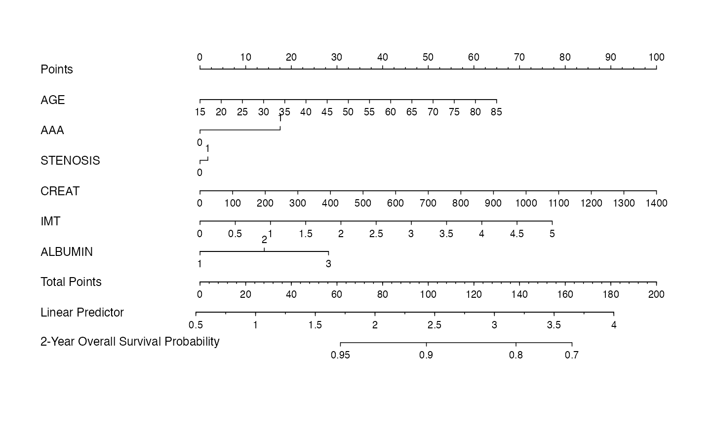
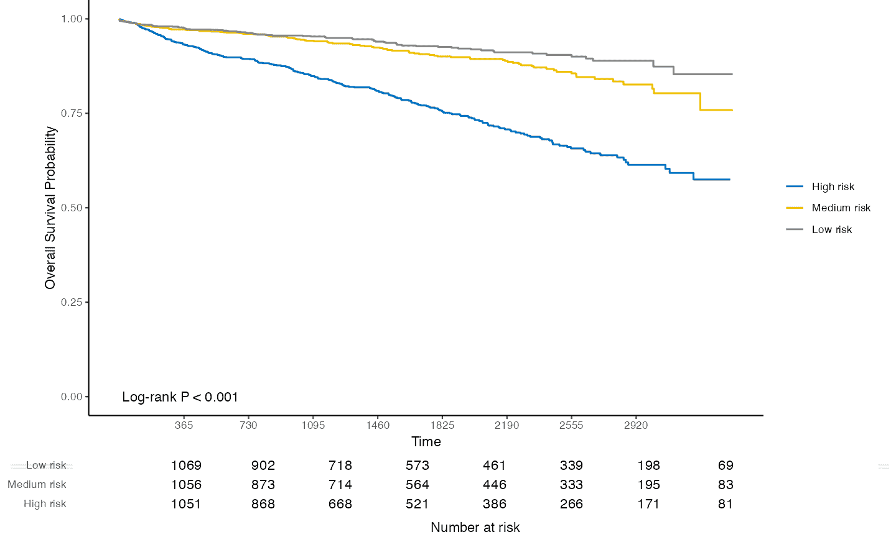
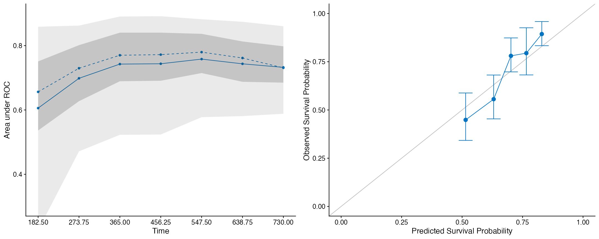
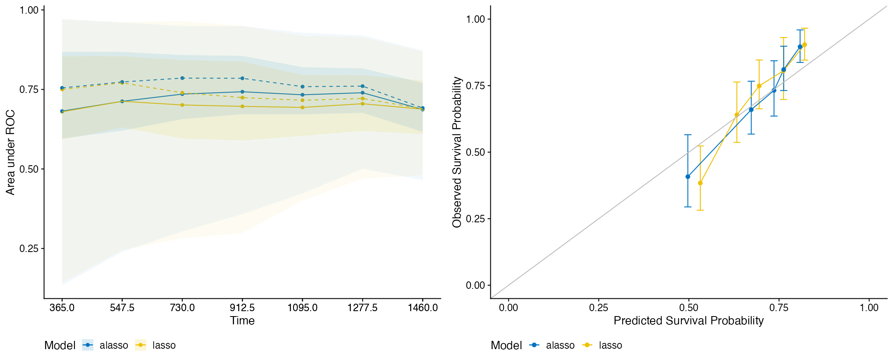

# hdnom

`hdnom` creates nomogram visualizations for penalized Cox regression
models, with the support of reproducible survival model building,
validation, calibration, and comparison for high-dimensional data.

## Installation

You can install `hdnom` from CRAN:

``` r

install.packages("hdnom")
```

Or try the development version on GitHub:

``` r

remotes::install_github("nanxstats/hdnom")
```

Browse [the vignettes](https://nanx.me/hdnom/articles/) to get started.

## Gallery

### Nomogram



### Kaplan-Meier plot with number at risk table



### Model validation and calibration



### Model comparison by validation or calibration



## Shiny app

- Shiny app: <https://github.com/nanxstats/hdnom-app>
- Shiny app maker: <https://github.com/nanxstats/hdnom-appmaker>

## Contribute

To contribute to this project, please take a look at the [Contributing
Guidelines](https://nanx.me/hdnom/CONTRIBUTING.html) first. Please note
that the hdnom project is released with a [Contributor Code of
Conduct](https://nanx.me/hdnom/CODE_OF_CONDUCT.html). By contributing to
this project, you agree to abide by its terms.
